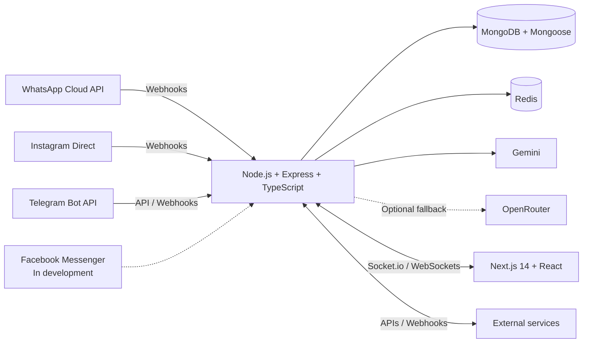

# 🚀 Whabot Pro v1.5 • Multichannel conversational automation

**[🇪🇸 Español](./README.md)** | **🇺🇸 English**

 

WhatsApp Cloud API • Instagram Direct • Telegram Bots • Gemini AI • Automations • CRM • Campaigns • Catalogs • Visual flow editor

**[Whabot Pro website](https://whabot.pro)** · **[NachoTech / NTDesWeb](https://www.ntdesweb.com)**

> [!IMPORTANT]
> **PUBLIC SHOWCASE AND COMMERCIAL DEMO REPOSITORY:** this repository contains documentation, a high-level architecture description, and a static Whabot Pro landing page. The production backend, frontend, and commercial algorithms remain in private repositories.

## 📍 Product status

Legend: ✅ Available · 🧪 In testing · 🚧 In development · 🗺️ Roadmap

| Channel or capability | Status | Scope |
|---|---|---|
| WhatsApp Cloud API | ✅ Available | Messaging, templates, interactive elements, and catalogs within Meta's supported capabilities. |
| Instagram Direct and comments | ✅ Available* | Direct messages and comment automation. |
| Telegram Bots | ✅ Available | Bots, commands, and automation through the Telegram API. |
| Automations, rules, and visual flow editor | ✅ Available | Design and execution of conversational flows. |
| CRM, campaigns, catalogs, multi-agent, and analytics | ✅ Available | Operational and tracking tools within the platform. |
| Voice features | 🚧 In development | Voice capabilities remain subject to technical evolution and testing. |
| Facebook Messenger | 🚧 In development | Not currently available. |

\* Some Instagram and other Meta integration features depend on app permissions, Meta review, and current platform policies.

## 🤖 AI and integrations

- **Primary AI provider:** Gemini.
- **Optional fallback:** OpenRouter, depending on deployment configuration.
- **External integrations:** APIs and webhooks. No fixed number of connectors is claimed.
- **Real-time communication:** Socket.io and WebSockets for events between the backend and authorized interfaces.

## 🖼️ Visual gallery

### Multichannel conversational automation

### AI and visual flow editor

### Platform integrations

### Commercial and payment flows

### Use cases

### Centralized management

> Images are commercial showcase assets. Current module availability is defined by the **Product status** table.

## 🛠️ Technical architecture

- **Backend:** Node.js, Express, and TypeScript.
- **Persistence:** MongoDB through Mongoose.
- **Temporary state and operational support:** Redis.
- **Real-time communication:** Socket.io and WebSockets.
- **Frontend:** Next.js 14 and React.
- **AI:** Gemini as the primary provider, with optional fallback through OpenRouter.

The diagram describes high-level components without exposing code, credentials, private topology, or internal deployment details.

## 🌐 Official links

- [Whabot Pro](https://whabot.pro)
- [NachoTech / NTDesWeb](https://www.ntdesweb.com)
- [GitHub showcase](https://github.com/NachoTorresRD/whabot-pro-showcase)

---

Designed and developed by **NachoTechRD** © 2026. Production source code is private.

