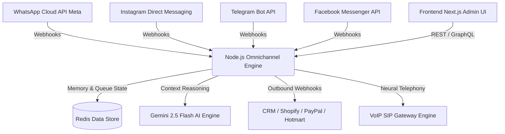

<!-- ========================================================================== -->
<!-- NT-SKILL SUPREME README ENGINE - WHABOT PRO SHOWCASE                       -->
<!-- ========================================================================== -->

<div align="center">

# 🚀 Whabot Pro v1.5 • Enterprise Omnichannel AI Engine

[](https://github.com/NachoTorresRD/whabot-pro-showcase)
[](https://github.com/NachoTorresRD/whabot-pro-showcase)
[](https://github.com/NachoTorresRD/whabot-pro-showcase)
[](https://github.com/NachoTorresRD/whabot-pro-showcase)

**[ 🇪🇸 Español ]** | **[ 🇺🇸 English ]**

<br>


<br>

### *Plataforma Enterprise Omnicanal de Automatización Conversacional (WhatsApp Cloud API • Instagram Direct • Telegram Bots • Messenger Próximamente), Agentes IA (Gemini 2.5 Flash), Editor de Flujos Visuales, VoIP Neural y Pasarelas de Pago Integradas.*

---

</div>

> [!IMPORTANT]
> **REPOSOTORIO PÚBLICO DE SHOWCASE Y DEMOSTRACIÓN COMERCIAL**:
> Este repositorio contiene la documentación pública, especificaciones de arquitectura y la landing estática de demostración para la suite **Whabot Pro**. El código fuente backend y los algoritmos de producción se mantienen en nuestro repositorio privado bajo custodia de **NachoTechRD**.

> [!NOTE]
> Para licencias enterprise, integraciones personalizadas o despliegues dedicados On-Premises, contacta directamente al equipo de ingeniería.

---

## 🌐 Cobertura Omnicanal de Mensajería

- **🟢 WhatsApp Cloud API**: API Oficial de Meta con soporte para botones, listas interactivas, catálogos y plantillas HSM.
- **🟣 Instagram Direct (DM)**: Automatización inteligente para mensajes directos, comentarios en publicaciones, historias y menciones.
- **🔵 Telegram Bots Engine**: Conexión nativa con bots y canales de Telegram para difusión masiva y soporte.
- **⚡ Facebook Messenger** *(Muy Pronto)*: Integración unificada para páginas de Facebook con el mismo motor de IA.

---

## ⚡ Matriz Comparativa de Módulos Whabot Pro

| Módulo / Capacidad | Plan Standard | Whabot Pro v1.5 (Supreme) | Beneficio Clave |
| :--- | :---: | :---: | :--- |
| **Soporte Multicanal** | Solo WhatsApp básico | **✅ WhatsApp + Instagram + Telegram + Messenger** | Unifica todas tus fuentes de prospectos en un único panel inteligente. |
| **Proveedor de IA** | GPT-3.5 Legacy | **✅ Gemini 2.5 Flash Exclusivo** | Cero latencia, razonamiento contextual profundo y menor costo operativo. |
| **Arquitectura Multi-Agente** | ❌ Monolítico | **✅ Agentes Compartidos** | Especialización por departamentos (Ventas, Soporte, Facturación). |
| **Editor de Flujos** | Plantillas Rígidas | **✅ Visual Drag & Drop** | Creación flexible con diagramas condicionales y variables dinámicas. |
| **Llamadas de Voz VoIP** | ❌ No disponible | **✅ Síntesis Neural VoIP** | Confirmación automatizada de citas por voz en tiempo real. |
| **Pasarelas de Pago** | Enlace Manual | **✅ PayPal & Hotmart Native** | Cobro automatizado y verificación en ventana de chat. |
| **Webhooks & API Sync** | Restringido | **✅ 50+ Integraciones CRM** | Conexión directa con HubSpot, Salesforce, Zoho, Shopify y Webhooks. |

---

## 🖼️ Galería Visual Pro (Pro Social Assets Engine)

<div align="center">

### 1. Conversión de Chats a Ventas Reales (Omnicanal)


### 2. Automatización Inteligente con IA + Voz Neural


### 3. Solución Completa: Más que un simple Bot


### 4. Recuperación de Chats Perdidos y Cobros Directos


### 5. Matriz de Casos de Uso Enterprise


### 6. Sistema Unificado de Gestión Omnicanal


</div>

---

## 🛠️ Arquitectura Técnica & Stack Tecnológico



- **Core Engine**: Node.js v20+, TypeScript 5+, Express/Fastify API REST Server.
- **Frontend Dashboard**: Next.js 14, React 18, TailwindCSS, NT-Skill Supreme Engine tokens.
- **Database & Queue**: Redis, PostgreSQL con ORM Prisma para alto rendimiento conversacional.
- **AI Acceleration**: Google Gemini 2.5 Flash SDK nativo con fallback resiliente.

---

## 🌐 Embudo de Conversión & Ecosistema (Upsell Hub)

Conoce y conecta todas las soluciones de la suite de software **NachoTechRD**:

```
 ┌──────────────────────────┐      ┌──────────────────────────┐      ┌──────────────────────────┐
 │      🤖 WHABOT PRO       │ ◄──► │      💼 POSENT PRO       │ ◄──► │  ✨ AGENCIA 3D STUDIO    │
 │ Omnichannel AI & Voice   │      │ Cloud ERP, POS & Taxes   │      │ Immersive Web 3D Engines │
 └──────────────────────────┘      └──────────────────────────┘      └──────────────────────────┘
```

- **[🤖 Whabot Pro](https://github.com/NachoTorresRD/whabot-pro-showcase)**: Solución líder de automatización omnicanal (WhatsApp, Instagram, Telegram & Messenger).
- **[💼 Posent Pro](https://github.com/NachoTorresRD)**: Plataforma ERP de punto de venta e inventario inteligente en la nube.
- **[✨ Agencia 3D Studio](https://github.com/NachoTorresRD)**: Desarrollo de sitios web inmersivos 3D con estética **NT-Skill Supreme**.

---

<div align="center">

Diseñado & Desarrollado por **NachoTechRD** bajo el marco **NT-Skill Supreme Engine** © 2026.

</div>
