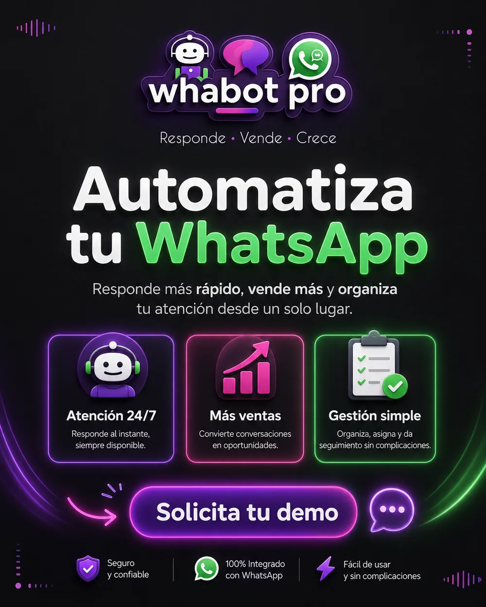
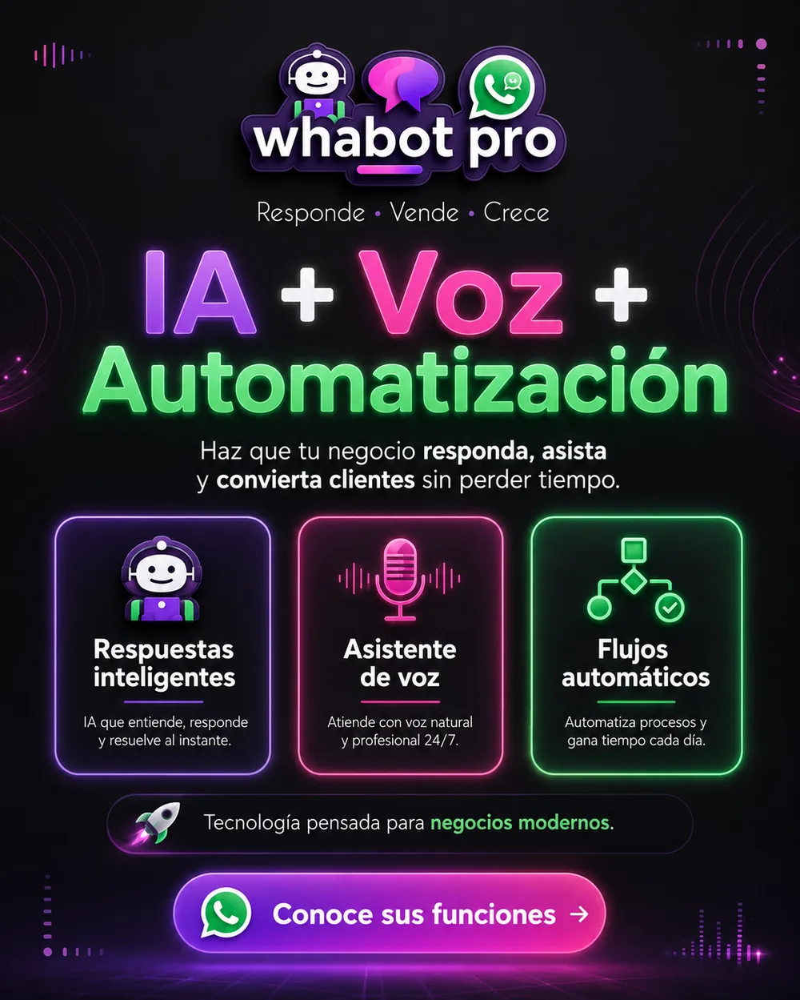
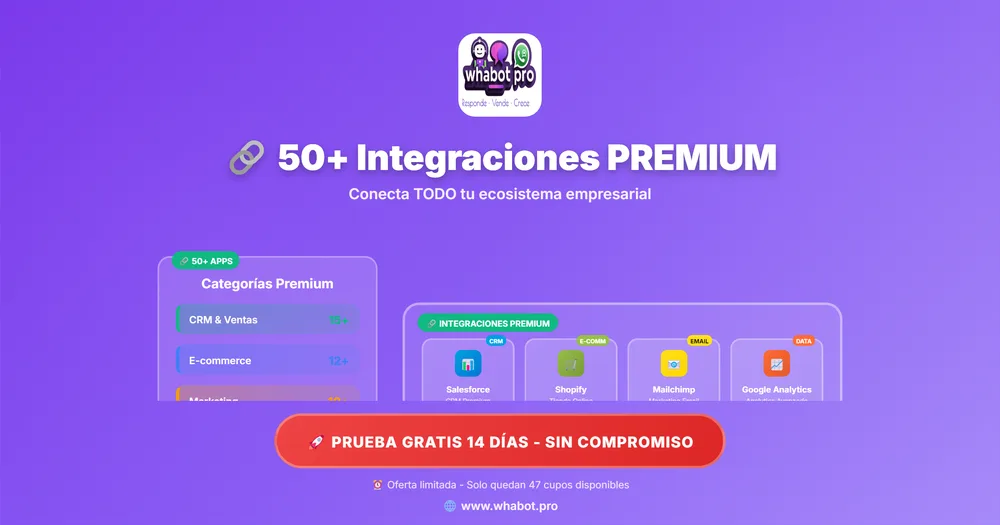
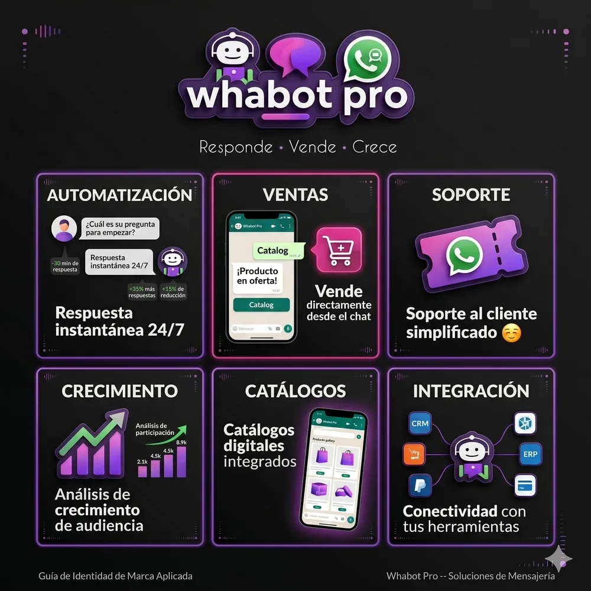
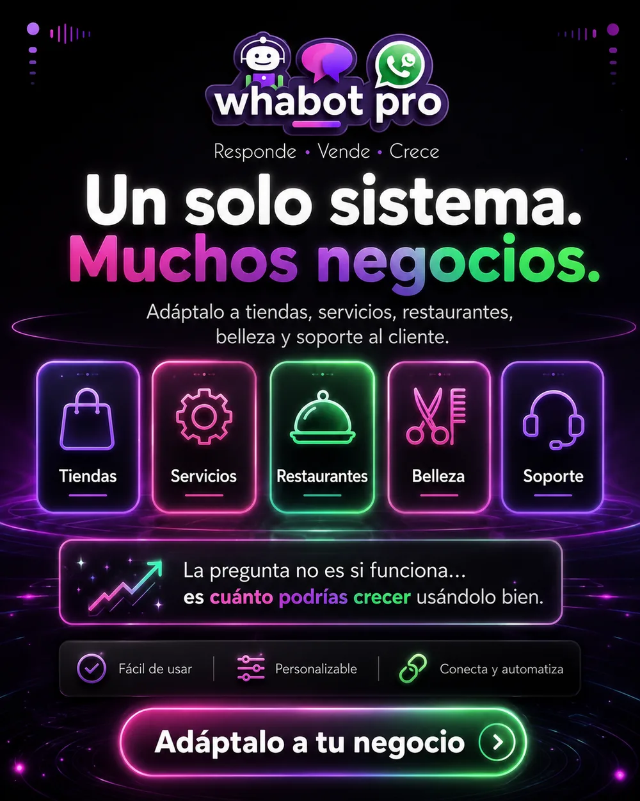
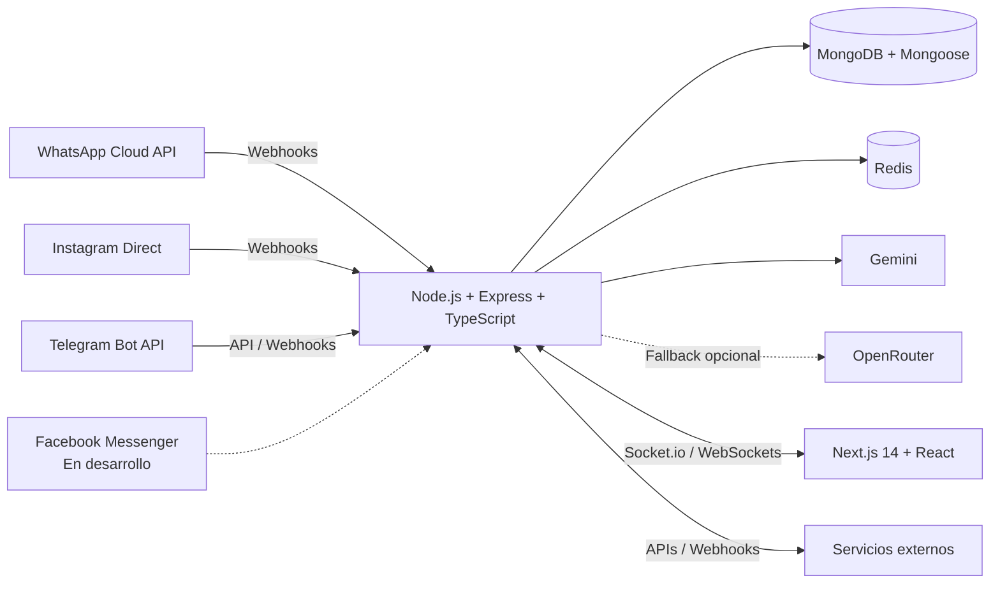

# 🚀 Whabot Pro v1.5 • Automatización conversacional multicanal

**🇪🇸 Español** | **[🇺🇸 English](./README.en.md)**

 

WhatsApp Cloud API • Instagram Direct • Telegram Bots • IA con Gemini • Automatizaciones • CRM • Campañas • Catálogos • Editor visual de flujos

**[Sitio de Whabot Pro](https://whabot.pro)** · **[NachoTech / NTDesWeb](https://www.ntdesweb.com)**

> [!IMPORTANT]
> **REPOSITORIO PÚBLICO DE SHOWCASE Y DEMOSTRACIÓN COMERCIAL:** contiene documentación, una descripción de arquitectura y una landing estática de Whabot Pro. El backend, el frontend de producción y los algoritmos comerciales permanecen en repositorios privados.

## 📍 Estado del producto

Leyenda: ✅ Disponible · 🧪 En pruebas · 🚧 En desarrollo · 🗺️ Roadmap

| Canal o capacidad | Estado | Alcance |
|---|---|---|
| WhatsApp Cloud API | ✅ Disponible | Mensajería, plantillas, elementos interactivos y catálogos según las capacidades de Meta. |
| Instagram Direct y comentarios | ✅ Disponible* | Mensajes directos y automatización de comentarios. |
| Telegram Bots | ✅ Disponible | Bots, comandos y automatizaciones mediante la API de Telegram. |
| Automatizaciones, reglas y editor visual de flujos | ✅ Disponible | Diseño y ejecución de flujos conversacionales. |
| CRM, campañas, catálogos, multiagente y analíticas | ✅ Disponible | Herramientas de operación y seguimiento dentro de la plataforma. |
| Funciones de voz | 🚧 En desarrollo | Capacidades de voz sujetas a evolución técnica y pruebas. |
| Facebook Messenger | 🚧 En desarrollo | No disponible actualmente. |

\* Algunas funciones de Instagram y otras integraciones de Meta dependen de los permisos concedidos a la aplicación, la revisión de Meta y las políticas vigentes de la plataforma.

## 🤖 IA e integraciones

- **Proveedor principal de IA:** Gemini.
- **Fallback opcional:** OpenRouter, según la configuración del despliegue.
- **Integraciones externas:** APIs y webhooks. No se afirma un número fijo de conectores.
- **Tiempo real:** Socket.io y WebSockets para eventos entre el backend y las interfaces autorizadas.

## 🖼️ Galería visual

### Automatización conversacional multicanal

### IA y editor visual

### Integraciones de la plataforma

### Flujos comerciales y pagos

### Casos de uso

### Gestión centralizada

> Las imágenes son recursos comerciales del showcase. La disponibilidad actual de cada módulo se rige por la tabla **Estado del producto**.

## 🛠️ Arquitectura técnica

- **Backend:** Node.js, Express y TypeScript.
- **Persistencia:** MongoDB mediante Mongoose.
- **Estado temporal y soporte operativo:** Redis.
- **Comunicación en tiempo real:** Socket.io y WebSockets.
- **Frontend:** Next.js 14 y React.
- **IA:** Gemini como proveedor principal, con posibilidad de fallback mediante OpenRouter.

El diagrama describe los componentes de alto nivel sin exponer código, credenciales, topología privada ni detalles internos de despliegue.

## 🌐 Enlaces oficiales

- [Whabot Pro](https://whabot.pro)
- [NachoTech / NTDesWeb](https://www.ntdesweb.com)
- [Showcase en GitHub](https://github.com/NachoTorresRD/whabot-pro-showcase)

---

Diseñado y desarrollado por **NachoTechRD** © 2026. Código de producción privado.

